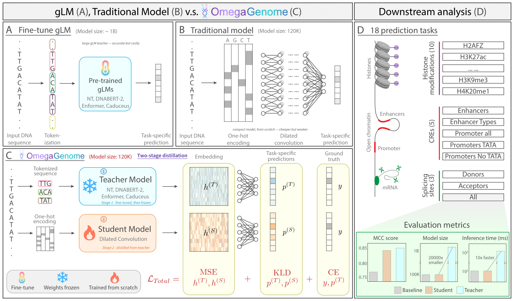
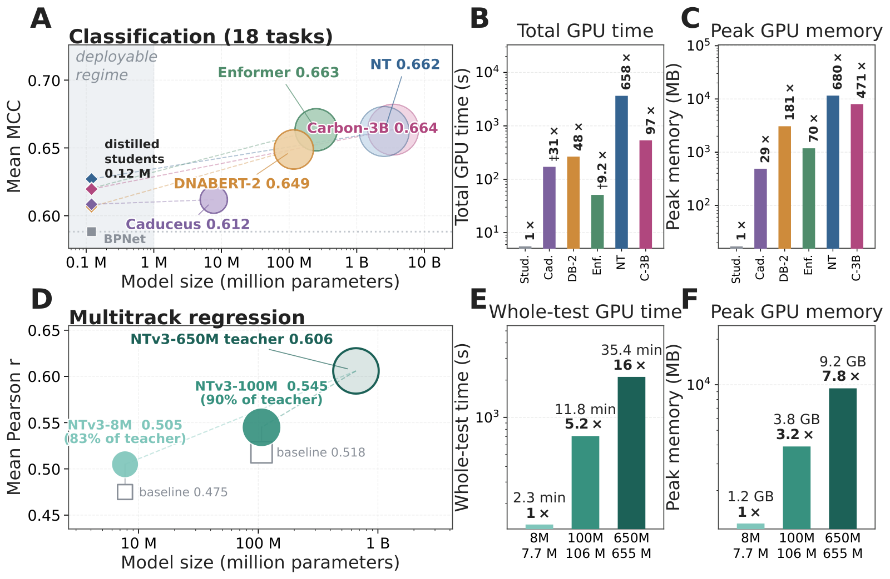

<h1 align="center">OmegaGenome</h1>

<p align="center">
  <b>Toward better sub-million-scale expert models from large genomic language models<br>via knowledge distillation</b>
</p>

<p align="center">
  Pengcheng Xu · Junhao Liu · Yi Dai · Kainoa Andrew Nishida · Dongbo Sun ·<br>
  Yutong Lei · Yaqi Hu · Chaoyang Wang · Jing Zhang
  <br><i>University of California, Irvine</i>
</p>

<p align="center">
  <a href="https://github.com/aicb-ZhangLabs/OmegaGenome/actions/workflows/main.yaml"></a>
  <a href="https://doi.org/10.5281/zenodo.22805335"></a>
  <a href="LICENSE"></a>
  
  <br>
  <a href="https://huggingface.co/datasets/InstaDeepAI/nucleotide_transformer_downstream_tasks_revised"></a>
  <a href="https://huggingface.co/explcre/omegagenome-distilled-students"></a>
  <a href="https://huggingface.co/ryan-superman/nt-2.5b-lora-teachers-r48"></a>
</p>

<p align="center">
  <a href="https://explcre.github.io/OmegaGenome-Project/"><b>Project page</b></a> ·
  <a href="https://doi.org/10.5281/zenodo.22805335"><b>Archive &amp; DOI</b></a> ·
  <a href="https://huggingface.co/explcre/omegagenome-distilled-students"><b>Checkpoints</b></a> ·
  <a href="https://huggingface.co/datasets/InstaDeepAI/nucleotide_transformer_downstream_tasks_revised"><b>Dataset</b></a>
</p>

<p align="center">
  
</p>

A large genomic language model (gLM) is fine-tuned on one downstream task and then compressed into a
compact student that keeps most of the teacher's accuracy at a fraction of the inference cost. The
deployable student has **~0.12 M parameters** — roughly 1/20,000 of a 2.5-billion-parameter teacher —
and still beats a same-architecture model trained from scratch on all 18 benchmark tasks.

This repository holds the training, evaluation and analysis code, the figure code, and the
main-text figures. It is archived at Zenodo under
**[10.5281/zenodo.22805335](https://doi.org/10.5281/zenodo.22805335)**, a DOI that always resolves to
the latest archived version.

## Highlights

- **Five teachers, one recipe.** NT-2.5B, DNABERT-2, Enformer, Caduceus and Carbon-3B are distilled
  with the same two-stage objective; adding a teacher is one config entry.
- **A 0.12 M student recovers most of the teacher.** 18-task mean MCC 0.627 for the
  NT-distilled student against 0.662 for its 2.5-billion-parameter teacher and 0.588 for the
  from-scratch baseline.
- **Up to 658× faster and 680× lighter.** Whole-benchmark GPU inference drops from 7,304 s (NT-2.5B)
  to 11.1 s, and peak GPU memory from 11.3 GB to 17 MB, on the same RTX 3090.
- **Not only classification.** On a base-resolution 34-track regression benchmark the distilled
  student is ~200× faster and ~106× lighter than the NTv3-650M teacher, and beats a size-matched
  from-scratch baseline at every size and in every assay family.
- **Reproducible figures.** 22 of the 23 figure scripts redraw the paper's panels from the bundled
  result tables on a laptop — no GPU, no downloads.

## Results

18-task mean test MCC on the revised Nucleotide Transformer benchmark (three seeds; the full
per-task tables are in [`paper_figures/data/`](paper_figures/data)):

| Teacher | Teacher MCC | Distilled student (0.12 M) MCC | From-scratch baseline |
|---|---|---|---|
| Carbon-3B | 0.664 | **0.620** | 0.588 |
| Enformer | 0.663 | **0.620** | 0.588 |
| NT-2.5B | 0.662 | **0.627** | 0.588 |
| DNABERT-2 | 0.649 | **0.607** | 0.588 |
| Caduceus | 0.612 | **0.608** | 0.588 |

Measured inference cost over the whole benchmark, single RTX 3090, and a full 3,000-example task on
16 CPU threads ([`paper_figures/data/efficiency_18task_authoritative.csv`](paper_figures/data/efficiency_18task_authoritative.csv)):

| Model | Params | All-18 GPU time | Peak GPU memory | One task on CPU |
|---|---|---|---|---|
| NT-2.5B | 2.54 B | 7,304 s | 11,553 MB | 8.3 h |
| Carbon-3B | 3.45 B | 1,073 s | 8,004 MB | 6.6 h |
| DNABERT-2 | 117 M | 531 s | 3,074 MB | 23.6 min |
| Caduceus | 7.7 M | 342 s | 489 MB | 4.2 h |
| Enformer | 251 M | 102 s | 1,184 MB | 1.9 min |
| **OmegaGenome student** | **0.12 M** | **11.1 s** | **17 MB** | **2.65 s** |

<p align="center">
  
  <br><sub>Distilled students match teacher accuracy at a fraction of the compute, for both the
  classification benchmark (top) and the base-resolution regression benchmark (bottom).</sub>
</p>

## Method

Two stages:

1. **Teacher fine-tuning** — a pre-trained gLM (NT-2.5B, DNABERT-2, Enformer, Caduceus or
   Carbon-3B) is fine-tuned per task, fully or with LoRA for the billion-parameter teachers.
2. **Distillation** — a compact student (a ~0.12 M-parameter BPNet for classification, a dilated
   track network for base-resolution regression) is trained with a supervised task loss, an
   output-matching loss against the teacher, and a feature-alignment loss.

Evaluation covers the 18 classification tasks of the revised Nucleotide Transformer benchmark and a
base-resolution, multi-track regression benchmark.

## Repository layout

| Path | Contents |
|---|---|
| `src/model/` | teacher wrappers (gLMs, NTv3) and student architectures (BPNet, dilated track net) |
| `src/train/` | entry points: teacher fine-tuning, distillation, hyperparameter search, benchmarking |
| `src/trainer/` | training loops, distillation losses, teacher caching, metrics |
| `src/data/` | dataset loading and preprocessing |
| `src/eval/` | evaluation helpers |
| `config/` | experiment configurations (tyro dataclasses) for teachers and distillation |
| `slurm/` | cluster submission scripts, grid generation and result aggregation |
| `scripts/` | standalone entry points; `scripts/experiments/` holds campaign driver scripts |
| `analysis/` | analysis code: cross-task transfer, feature-space comparison, KD-method comparison |
| `paper_figures/` | the main-text figures as submitted, the code that draws them, and the tables it reads |
| `best_hp_all_teachers/`, `best_hyperparams.json` | selected hyperparameters per teacher and task |
| `results/` | collated result tables |
| `docs/` | dataset and design documentation |
| `tests/` | unit tests |

## Installation

Requires Python 3.11 and [uv](https://docs.astral.sh/uv/).

```bash
git clone https://github.com/aicb-ZhangLabs/OmegaGenome.git
cd OmegaGenome
cp env_sample.toml env.toml     # then edit the project path and SLURM defaults inside
```

The teachers need mutually incompatible dependency sets, so each lives in its own environment:

```bash
uv sync --extra default                                             # NT-2.5B, DNABERT-2, Enformer, Carbon-3B
UV_PROJECT_ENVIRONMENT=.venv_caduceus uv sync --extra caduceus      # Caduceus
UV_PROJECT_ENVIRONMENT=.venv_aido_dna uv sync --extra aido_dna      # AIDO.DNA
UV_PROJECT_ENVIRONMENT=.venv_ntv3 uv sync --extra ntv3              # base-resolution regression
```

The figure and analysis scripts need only `uv sync --extra analysis` (matplotlib, seaborn, scipy).

Activate an environment before adding packages to it:

```bash
source .venv_caduceus/bin/activate
uv add <package> --optional caduceus --active
```

The SLURM scripts source `slurm/env_setup.sh` and run a node-portable interpreter at
`.venv_carbon_portable/bin/python`, created with
`UV_PROJECT_ENVIRONMENT=.venv_carbon_portable uv sync --extra default`.

## Data

All datasets are public; this study generated none of them.

- **Classification** — the revised Nucleotide Transformer benchmark,
  [`InstaDeepAI/nucleotide_transformer_downstream_tasks_revised`](https://huggingface.co/datasets/InstaDeepAI/nucleotide_transformer_downstream_tasks_revised).
- **Regression** — tracks derived from [ENCODE](https://www.encodeproject.org) and
  [GENCODE](https://www.gencodegenes.org); see [docs/ntv3-dataset.md](docs/ntv3-dataset.md).

Keep large files outside the repository and link them in:

```bash
ln -s /path/to/storage/OmegaGenome/data   data
ln -s /path/to/storage/OmegaGenome/output output
```

## Model checkpoints

Released on the Hugging Face Hub. Every student can also be regenerated from the public datasets
with the code here.

| Repository | Contents | Licence |
|---|---|---|
| [`explcre/omegagenome-distilled-students`](https://huggingface.co/explcre/omegagenome-distilled-students) | the distilled ~0.12 M students, 5 teachers × 18 tasks × 3 seeds | mixed, per teacher — see the model card |
| [`ryan-superman/nt-2.5b-lora-teachers-r48`](https://huggingface.co/ryan-superman/nt-2.5b-lora-teachers-r48) | the 18 NT-2.5B LoRA teacher adapters used in the paper (r=48, α=64) | CC BY-NC-SA 4.0, inherited from NT-2.5B |
| [`explcre/carbon-3b-lora-teachers-nt18`](https://huggingface.co/explcre/carbon-3b-lora-teachers-nt18) | the 18 Carbon-3B LoRA teacher adapters (r=16, α=32) | Apache-2.0, inherited from Carbon-3B |
| [`explcre/nt-2.5b-lora-teachers-r32`](https://huggingface.co/explcre/nt-2.5b-lora-teachers-r32) | an earlier NT-2.5B adapter set (r=32) | CC BY-NC-SA 4.0, inherited from NT-2.5B |

A student distilled from a non-commercially licensed teacher inherits that restriction; the code in
this repository is MIT regardless.

```python
from huggingface_hub import snapshot_download
snapshot_download("explcre/omegagenome-distilled-students", allow_patterns="nt/H3K4me3/*")
```

## Configuration

Machine-specific locations are read from the environment, so no path is hardcoded. The defaults
assume the commands run from the repository root.

| Variable | Meaning | Default |
|---|---|---|
| `OG_ROOT` | this repository checkout | current directory |
| `OG_SCRATCH` | fast local disk for run outputs and caches | `./output` |
| `OG_STORE` | long-term storage for teacher checkpoints and HF caches | `./data` |
| `OG_WORKSPACE` | parent directory holding this repo and the figure repo | parent of the current directory |
| `CARBON_TEACHER_DIR` | parent of the 18 `{task}_finetuned/` Carbon-3B LoRA adapters | `$OG_STORE/finetuned_models` |
| `NT_TEACHER_DIR` | parent of the NT-2.5B LoRA adapters | `data/finetuned_models/` |
| `NTV3_100M_DIR` | local copy of the post-trained NTv3-100M weights | `$OG_SCRATCH/ntv3_local/100m_post` |
| `HF_TOKEN_FILE` | file holding a HuggingFace token, for gated datasets | unset |

`config/distillation/paths.py` is the single place these defaults are resolved; `env.toml` (copied
from `env_sample.toml`) holds the project path and the SLURM submission defaults.

## Usage

### Stage 1 — fine-tune a teacher

`src.train.finetune_teacher <config> [task] [overrides]`, with the configs in
`config/distillation/teacher_finetune.py`:

| config | meaning |
|---|---|
| `carbon_3b` | 18-task LoRA fine-tune of Carbon-3B (10 epochs, lr 1e-4, cosine, LoRA r16/α32/dropout 0.1 on all linear projections, early-stop patience 3) |
| `carbon_3b_debug` | one task, one epoch — smoke test |
| `carbon_3b_fullft` | full fine-tune, no LoRA |
| `carbon_8b_finetune` | Carbon-8B variant |

```bash
sbatch slurm/carbon_finetune.sbatch carbon_3b                 # whole 18-task run, one job
sbatch slurm/carbon_finetune.sbatch carbon_3b H3K4me3         # single task
sbatch slurm/carbon_finetune.sbatch                           # defaults to carbon_3b_debug
python -m src.train.finetune_teacher carbon_3b --config.epochs 5 --config.task-names H3K4me3
python -m src.train.finetune_teacher carbon_3b --config.use-lora False
python -m src.train.finetune_teacher -h                       # all overrides
```

The best checkpoint per task (by validation MCC) is written to `<output_dir>/<task>_finetuned/`,
which is exactly what Stage 2 loads as the teacher.

### Stage 2 — distil into a student

`src.train.distill <config> [overrides]`, with the configs in
`config/distillation/experiments/`:

| config | meaning |
|---|---|
| `carbon-raw` | 18-task distillation, raw feature MSE (ce 0.5 / kl 0.5 / mse 0.2) |
| `carbon-l2norm` | the same, with L2-normalised feature MSE |
| `carbon-base-raw` | the hyperparameter grid: kl {0, .25, .5, 1} × mse {0, 1, 2, 5} × T {.5, 1, 1.5, 2, 4} |
| `carbon-smoke` | tiny inline smoke test |

```bash
sbatch slurm/carbon_distill.sbatch carbon-smoke                  # inline on the allocated GPU
python -m src.train.distill carbon-raw                           # mode="slurm": fans out one job per task
python -m src.train.distill carbon-raw --task-names H3K27me3 \
  --distillation-config.weight-kl 0.5 --distillation-config.weight-mse 2 \
  --distillation-config.temperature 4.0
python -m src.train.distill -h
```

Each run writes `final_summary.json` and `summary.csv` next to its checkpoints under
`$CARBON_OUTPUT_BASE/deploy_120k/<task>/<timestamp>/<uuid>/<hyperparameters>/`. The training seed is
`--random-state` (default 42); the hyperparameter search keeps it fixed at 42 and the final phase
re-runs the selected configuration at seeds 0, 1 and 2.

### Base-resolution regression

The regression pipeline fine-tunes NTv3 on the benchmark's bigWig tracks and distils it into a
compact per-base-pair student:

```bash
sbatch slurm/ntv3_finetune.sbatch                     # faithful 650 M teacher fine-tune
sbatch slurm/ntv3_finetune.sbatch --use_lora          # cheaper LoRA variant
python -m src.train.ntv3_gen_targets --out <dir>      # cache the teacher's per-bp targets
python -m src.train.distill_tracks --data <dir> --out <dir> --model_size medium
python -m src.eval.per_track_csv --result <result.json> --meta <metadata.tsv> --out <csv>
```

`slurm/ntv3_precompute_joint34.sbatch` caches the 34-track teacher logits in one pass so the student
size sweep (`slurm/ntv3_size_sweep_*.sbatch`) trains teacher-free, and
`slurm/ntv3_assay_experiment.sbatch` runs the per-assay distilled-versus-from-scratch comparison.

### Hyperparameter search and multi-seed runs

```bash
python slurm/gen_hp_specs.py --out hp_specs.txt            # enumerate the grid; skips finished runs
bash slurm/auto_submit_specs.sh hp_specs.txt               # submit, filling free per-node slots
python slurm/extract_best_hyperparams.py --out best_hyperparams.json       # select on validation MCC
python slurm/gen_3seed_best_specs.py --best best_hyperparams.json --seeds 0 1 2 --out seeds.txt
python slurm/aggregate_3seed.py --seeds 0 1 2 --best best_hyperparams.json # per-task mean ± s.d.
```

Hyperparameters are always selected on validation MCC, never on test. Per-node job caps live in
`slurm/submit_caps.env` and are re-read on every loop of the submitter, so they can be changed
without restarting it.

### Tests and linting

```bash
python -m pytest tests/
ruff format . && ruff check .
```

## Figures

The six main-text figures ship as submitted in
[`paper_figures/figures/`](paper_figures/figures) (vector PDF, plus web-resolution PNG renders under
[`paper_figures/figures/png/`](paper_figures/figures/png)), next to the code that draws them and the
result tables that code reads. Figures 2, 3 and 5 regenerate from the bundled tables on a laptop in
seconds:

```bash
uv sync --extra analysis
cd paper_figures
python figure_panels/build/fig2_combined_carbon.py    # Figure 2
python figure_panels/build/fig4_efficiency_carbon.py  # Figure 3
python figure_panels/build/fig6_method_size_hp.py     # Figure 5
```

Figures 1 and 6 are hand-drawn schematics with no script; Figure 4 is built from extracted model
features by `analysis/extract_feats_logits.py` and `analysis/feature_viz_omega_dkd.py`, which need
the trained checkpoints. See [paper_figures/README.md](paper_figures/README.md) for the figure-to-script
map and the supplementary panels.

## Documentation

- [docs/carbon-teacher.md](docs/carbon-teacher.md) — the stage-1 teacher fine-tuning path and the
  per-teacher environments.
- [docs/ntv3-dataset.md](docs/ntv3-dataset.md) — the base-resolution multi-track dataset.
- [docs/assay-experiment.md](docs/assay-experiment.md) — the per-assay distillation versus
  from-scratch comparison.
- [docs/ntv3-io-example.md](docs/ntv3-io-example.md) — a worked input/output example for the
  base-resolution regression pipeline.
- [paper_figures/README.md](paper_figures/README.md) — which script draws which figure.

## Branches

- `main` — the full pipeline: teacher fine-tuning, distillation, evaluation and analysis for both
  the 18-task classification benchmark and the base-resolution multi-track regression benchmark,
  including the NTv3 student size sweep.
- `ntv3-size-ladder` — the development branch for the size-ladder work: reference notebooks and
  in-progress variants of the regression scripts.

## Citation

Please cite the paper and, if you use this code directly, the archived snapshot:

```bibtex
@software{omegagenome_code,
  title  = {OmegaGenome: source code},
  author = {Xu, Pengcheng and Liu, Junhao and Dai, Yi and Nishida, Kainoa Andrew and
            Sun, Dongbo and Lei, Yutong and Hu, Yaqi and Wang, Chaoyang and Zhang, Jing},
  year   = {2026},
  doi    = {10.5281/zenodo.22805335},
  url    = {https://doi.org/10.5281/zenodo.22805335}
}
```

## License

| What | Licence |
|---|---|
| the code in this repository | [MIT](LICENSE) |
| the figures in `paper_figures/figures/` | © the authors, reproduced from the manuscript |
| teacher weights, and students distilled from them | the upstream licence — CC BY-NC-SA 4.0 for NT-2.5B and NTv3-derived models, Apache-2.0 for Carbon-3B and Caduceus, CC BY 4.0 for Enformer |
| the benchmark datasets | the terms of their original providers (InstaDeep, ENCODE, GENCODE) |

A model distilled from a non-commercially licensed teacher inherits that restriction.
